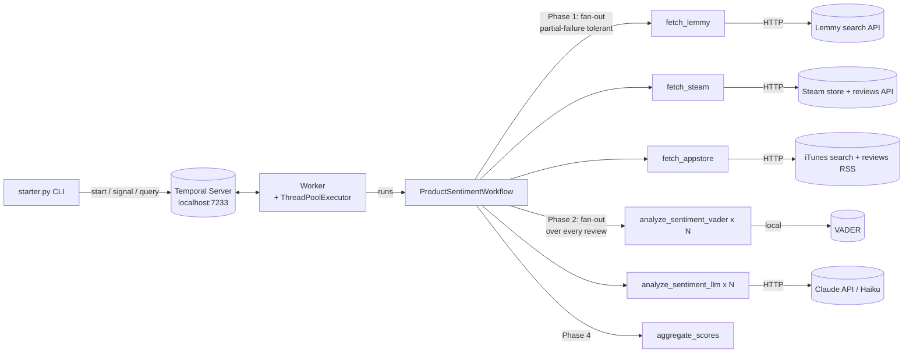

# Architecture

Each review is scored twice, concurrently: **VADER** (local, always succeeds)
and the **LLM** (a Claude API call, may fail per-review). The LLM fan-out is
fault-tolerant — a failed or unavailable LLM score falls back to `None` without
losing that review's VADER score, so the run still completes (and reports both
overall scores side by side) even with no API key configured.

Each source is an independent activity with its own retry policy and timeout, so
one source failing or being slow never blocks the others — the workflow
aggregates whatever succeeded and reports which sources failed. The activities
are synchronous and do blocking I/O, so the worker runs them on a
`ThreadPoolExecutor`; that's what lets the Phase 1 source fetches and the two
Phase 2 scorers actually execute in parallel rather than serializing on the
asyncio event loop.

Temporal persists the workflow event history, so a worker crash mid-run resumes
without re-fetching the sources that already completed.
